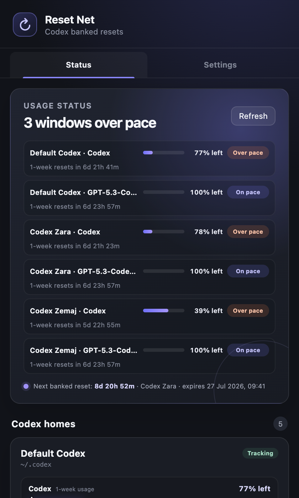
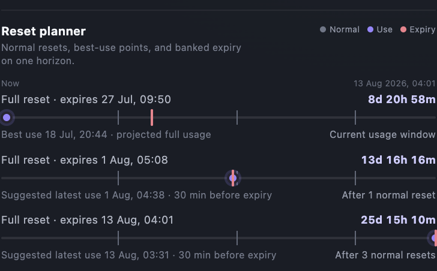
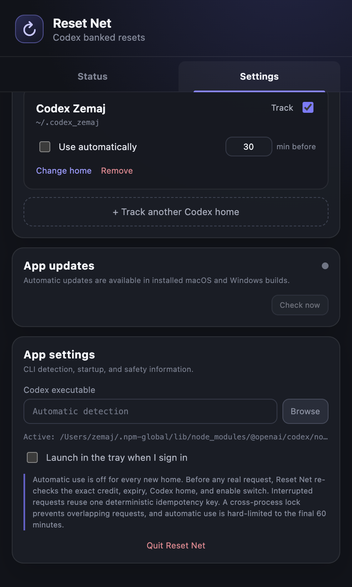

# Reset Net

Reset Net is a cross-platform tray/menu-bar app for Codex usage windows and banked usage-limit
resets. It shows how much normal usage remains, when each normal window resets, whether current use
is ahead of or behind a time-based pace, and when every banked reset should be used before expiry.

**Download latest:** [macOS universal DMG](https://github.com/just-every/banked-reset-safety-net/releases/latest/download/Reset-Net-mac-universal.dmg) · [Windows x64](https://github.com/just-every/banked-reset-safety-net/releases/latest/download/Reset-Net-win-x64.exe) · [Windows ARM64](https://github.com/just-every/banked-reset-safety-net/releases/latest/download/Reset-Net-win-arm64.exe) · [all release files](https://github.com/just-every/banked-reset-safety-net/releases/latest)

The macOS version runs in the menu bar. The same Electron application is packaged for Windows x64
and ARM64.

## What it looks like

The top status card summarizes every usage line across every tracked Codex home. Each profile then
shows its normal usage bars and banked-reset plan.



Every banked reset has its own timeline. Grey lines are normal usage resets, the purple point is the
best or latest suggested use, and the red line is the banked reset's final expiry.



Status and configuration now live on separate tabs, keeping normal usage and reset planning focused
while all automation controls remain together in Settings.



These 2x PNG screenshots use live, read-only Codex data from an isolated first-run configuration.
Automatic use is off for every automatically discovered home and the lead time is the default 30
minutes. No reset-consumption request was made while capturing them.

## Install

Signed builds are published on
[GitHub Releases](https://github.com/just-every/banked-reset-safety-net/releases):

- macOS universal DMG or ZIP;
- Windows x64 NSIS installer; or
- Windows ARM64 NSIS installer.

Published macOS builds are Developer ID signed, hardened, notarized by Apple, and verified with
Gatekeeper before the release can be created. Open the DMG and drag Reset Net to Applications.
Windows artifacts are not yet Authenticode signed, so Microsoft SmartScreen may show a warning.
Place `SHA256SUMS.txt` beside the downloaded assets and run `shasum -a 256 -c SHA256SUMS.txt`
on macOS (or `sha256sum -c SHA256SUMS.txt` on Linux) to verify them.

Reset Net runs in the menu bar without a Dock icon. Click its icon/countdown once to open the
window; right-click for Refresh and Quit.

## First run

1. Reset Net looks for the Codex CLI in common npm, Homebrew, ChatGPT app, and `PATH` locations.
2. It scans your user folder for `~/.codex` and sibling `.codex_*` or `.codex-*` directories.
   Inherited `CODEX_HOME` values do not change the desktop app's default.
3. Use **Scan now** after creating another Codex home, or **Track another Codex home** for a path
   elsewhere. A home you explicitly remove stays ignored by future automatic scans.
4. Leave **Use automatically** off if you only want usage and reset planning.
5. To automate a home, set the lead time (30 minutes by default), enable **Use automatically**, and
   accept the explicit confirmation.
6. Enable **Launch in the tray when I sign in** so a sleeping or restarted computer can resume the
   schedule. Reset Net must be running to act.

Every new profile starts with automatic use disabled. Changing a profile's `CODEX_HOME` also forces
automatic use off.

## Automatic app updates

Installed macOS and Windows builds check the latest public GitHub release shortly after startup and
every four hours while running. A newer release downloads in the background. Reset Net shows the
download state in **Settings → App updates**, sends a notification when the signed package is ready,
and installs it when the app next quits. **Restart and install** applies it immediately.

Development builds never contact the update feed. macOS updates use the signed universal ZIP;
Windows x64 and ARM64 have separate feeds and installers so an update cannot cross architectures.

## Normal usage and pacing

Codex can return multiple metered limits, such as the standard Codex limit and a model-specific
limit. Reset Net shows every bucket returned by `rateLimitsByLimitId`, including its primary and
secondary windows when present. A line reports:

- percent used and percent remaining;
- the window length supplied by Codex;
- the exact normal reset time and a live countdown; and
- a time-based pace status.

For a window of duration `D` ending at `R`, Reset Net derives the start as `R − D`. The expected
percentage used now is the percentage of time elapsed in that window. Actual usage more than five
percentage points above that value is **Over pace**; more than five points below is **Under pace**;
the middle band is **On pace**.

Pace is an explanatory comparison, not a guarantee about future demand. The projected full-usage
point assumes the current average rate continues. It is recalculated from each read-only refresh.

## Banked-reset planning

The planner uses the standard Codex primary window as its clock and draws repeated normal-reset
markers through the last banked expiry. Codex supplies the next reset; markers after it are an
explicit estimate that repeats the supplied window duration. For each available reset it shows:

- the expiry timestamp and countdown;
- which current or future normal-usage window the recommended point falls in;
- `expiry − configured lead time` as the latest safe use-by point; and
- an earlier **Best use** point when the current constant-rate projection reaches full usage before
  the natural normal reset.

Only the earliest banked reset can use that current-window projection. Later credits retain their
own use-by points, so multiple credits remain separate and visible. A best-use suggestion is
advisory: it never changes the automatic-use schedule. If automation is enabled, the app still acts
only at the configured use-by point inside the final 60 minutes.

## How it talks to Codex

Reset Net launches the user's installed CLI as:

```text
CODEX_HOME=/path/to/home codex app-server --stdio
```

It uses the CLI's structured JSON-RPC API rather than replaying arrow keys in the terminal UI:

- `account/rateLimits/read` discovers normal usage windows, reset IDs, and Unix expiry timestamps.
- `account/rateLimitResetCredit/consume` is isolated to the automatic-use runner.
- Every consume request includes the exact credit ID and a durable UUID idempotency key.
- Automatic requests are hard-limited to the final 60 minutes and hold an exclusive cross-process
  lock keyed by the backend credit and expiry.

Reset Net never reads or copies `auth.json`; authentication remains owned by the Codex CLI. Version
`0.144.5` is the tested baseline because it exposes detailed usage buckets, reset credits, and the
consume endpoint.

See [docs/SAFETY.md](docs/SAFETY.md) for the full redemption contract and retry behavior.

## Multiple Codex homes

Profiles are polled concurrently and use separate app-server processes with separate `CODEX_HOME`
environments. A profile stores only:

- display name;
- absolute Codex home path;
- tracking state;
- automatic-use state; and
- lead time.

Settings and the idempotency/audit ledger live in Electron's normal per-user application-data
directory:

- macOS: `~/Library/Application Support/Reset Net/`
- Windows: `%APPDATA%\Reset Net\`

## Development

Requirements: Node.js, pnpm, and an installed Codex CLI.

```bash
pnpm install
pnpm typecheck
pnpm test
pnpm dev
```

Run a real, read-only account probe (the app itself defaults to `~/.codex`):

```bash
pnpm probe -- --home ~/.codex
```

The probe only calls `account/rateLimits/read`; it has no call to the consume method and omits
credit IDs from its output. It prints the normalized normal-usage windows as well as banked expiry
details.

Build the application locally:

```bash
pnpm build
```

Signed macOS distribution requires the project signing credentials. See
[docs/RELEASING.md](docs/RELEASING.md) before running:

```bash
pnpm dist:mac
```

On Windows, build an architecture-specific NSIS installer with:

```powershell
pnpm install
pnpm dist:win:x64
# or: pnpm dist:win:arm64
```

CI builds the macOS universal, Windows x64, and Windows ARM64 targets in parallel. A version tag
publishes a GitHub release only after every artifact and the macOS security checks pass.

## Verified in this checkout

- Codex CLI `0.144.5` with live, read-only `account/rateLimits/read` calls
- standard and model-specific usage-bucket parsing
- multiple `CODEX_HOME` sessions polled concurrently
- development and built macOS tray UI through the real accessibility tree
- isolated first-run UI with automatic use off and `~/.codex` as the only profile
- renderer sandbox, context isolation, CommonJS preload bridge, and CSP
- twelve test files / forty tests, including pacing, planning, exact-credit, one-hour, lock,
  fail-closed ledger, no-auto-use, and single-click tray cases
- deterministic macOS and Windows icons generated from the checked-in logo source

No live redemption was requested while implementing, testing, or capturing this usage-planning
update.
